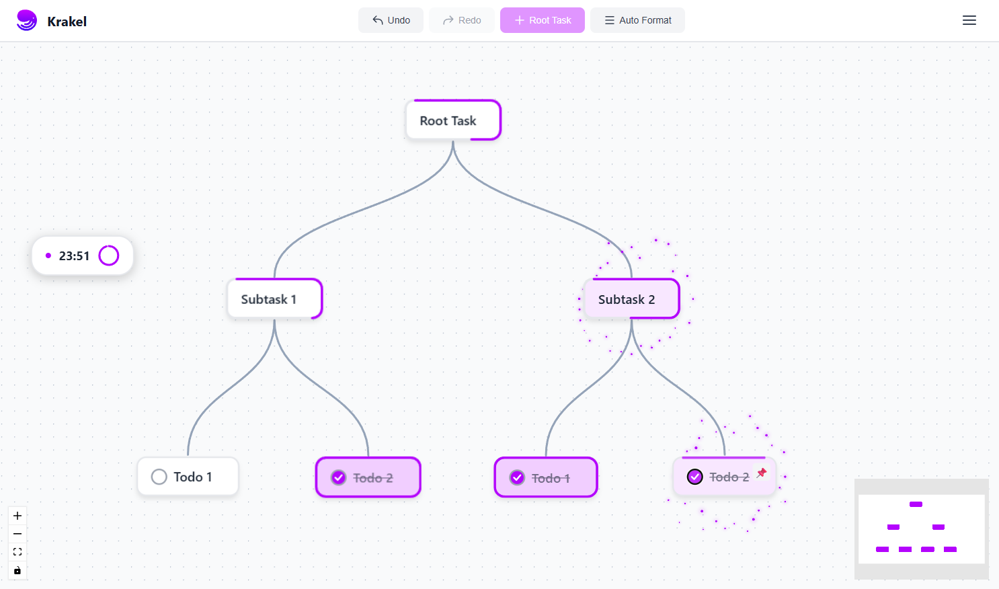

# 🐙 Krakel

A beautiful, interactive node-based task management application for organizing your work in hierarchical graphs. Create root tasks, break them down into subtasks, and track your progress visually with smooth animations and real-time updates.


## ✨ Features

### 🎯 Task Management
- **Hierarchical Graph Structure**: Create tasks with up to 3 levels (Root → Subtask → Todo)
- **Visual Node Editor**: Drag and drop nodes to reorganize your task structure
- **Auto Layout**: Automatically format your graph with smooth animations
- **Progress Tracking**: Visual progress indicators for parent tasks based on child completion
- **Completion Status**: Mark leaf tasks as complete with animated checkboxes

### 📌 Pinboard
- **Quick Access**: Pin important leaf tasks to a dedicated pinboard
- **Batch Management**: Organize pinned tasks into batches with custom titles
- **Bulk Actions**: Toggle all pinned tasks complete at once
- **Drag to Reorder**: Reorder pinned tasks by dragging

### ⏱️ Timer
- **Pomodoro Timer**: Built-in timer for focused work sessions
- **Minimizable**: Minimize to a compact bar or expand to full view
- **Draggable**: Move the timer anywhere on screen
- **Visual Progress**: Circular progress indicator showing time remaining

### 🎨 User Experience
- **Smooth Animations**: Buttery smooth drag-and-drop with optimized performance
- **Undo/Redo**: Full undo/redo support (up to 5 steps) for all actions
- **Keyboard Shortcuts**: 
  - `Backspace`/`Delete`: Delete selected node (with confirmation)
  - `Ctrl+Z` / `Cmd+Z`: Undo
  - `Ctrl+Y` / `Ctrl+Shift+Z`: Redo
- **Celebration Effects**: Animated particle effects when tasks are completed
- **Custom Cursors**: Custom drag cursors for better visual feedback

### 💾 Data Management
- **Save/Load**: Export and import your graph as JSON
- **Local Storage**: All data stored locally in your browser
- **Undo/Redo Stack**: Track your changes with undo/redo functionality

## 🚀 Tech Stack

- **Framework**: React 19.2
- **Build Tool**: Vite 7.2
- **Language**: TypeScript 5.9
- **State Management**: Zustand 5.0
- **Graph Visualization**: React Flow 11.11
- **Styling**: CSS-in-JS (inline styles)
- **Package Manager**: npm

## 📋 Prerequisites

- **Node.js**: v18 or higher
- **npm**: v9 or higher (or pnpm/yarn)

## 🛠️ Installation

1. **Clone the repository**
   ```bash
   git clone https://github.com/Jamroszczyk/krakel
   cd krakel
   ```

2. **Install dependencies**
   ```bash
   npm install
   ```

3. **Start the development server**
   ```bash
   npm run dev
   ```

4. **Open your browser**
   - Navigate to `http://localhost:5173` (or the port shown in terminal)

## 🏗️ Building for Production

```bash
# Build the application
npm run build

# Preview the production build
npm run preview
```

The built files will be in the `dist/` directory, ready to be deployed to any static hosting service.

## 📖 Usage Guide

### Creating Tasks

1. **Add Root Task**: Click the "Root Task" button in the topbar
2. **Add Subtask**: Click the "+" button at the bottom of a parent node
3. **Edit Task Name**: Double-click any node to edit its label
4. **Delete Task**: Select a node and press `Backspace` or `Delete` (confirmation required)

### Organizing Tasks

- **Drag Nodes**: Click and drag any node to reposition it
- **Auto Format**: Click "Auto Format" to automatically organize your graph
- **Manual Layout**: Drag nodes manually - children move with their parents

### Tracking Progress

- **Complete Tasks**: Click the checkbox on leaf nodes to mark them complete
- **Progress Bars**: Parent nodes show progress based on child completion
- **Celebration**: Animated particles appear when tasks are completed

### Using the Pinboard

1. **Pin Tasks**: Click the 📌 button on any leaf node
2. **Organize Batches**: Edit the batch title by clicking on it
3. **Reorder**: Drag pinned tasks to reorder them
4. **Bulk Complete**: Use the checkbox in the batch header to toggle all

### Using the Timer

1. **Set Time**: Click the timer display to edit minutes and seconds
2. **Start/Pause**: Use the Start/Pause button to control the timer
3. **Minimize**: Click the "−" button to minimize to a compact bar
4. **Move**: Drag the timer to reposition it anywhere on screen

### Keyboard Shortcuts

| Shortcut | Action |
|----------|--------|
| `Backspace` / `Delete` | Delete selected node (with confirmation) |
| `Ctrl+Z` / `Cmd+Z` | Undo last action |
| `Ctrl+Y` / `Ctrl+Shift+Z` | Redo last action |
| `Enter` | Finish editing node label |
| `Escape` | Cancel editing node label |

## 📁 Project Structure

```
krakel/
├── src/
│   ├── components/          # React components
│   │   ├── EditableNode.tsx # Node component with editing, completion, pinning
│   │   ├── GraphView.tsx    # Main graph canvas with drag handlers
│   │   ├── Pinboard.tsx     # Pinned tasks panel
│   │   ├── Timer.tsx        # Pomodoro timer component
│   │   └── Topbar.tsx       # Top navigation bar
│   ├── store/               # Zustand state management
│   │   └── graphStore.ts    # Main application state
│   ├── utils/               # Utility functions
│   │   ├── layoutEngine.ts  # Graph layout calculations
│   │   └── progressCalculation.ts # Progress tracking logic
│   ├── theme/               # Theme configuration
│   │   └── colors.ts        # Color palette
│   ├── App.tsx              # Root component
│   └── main.tsx             # Application entry point
├── public/                  # Static assets
│   ├── octopus_logo.svg     # Application logo
│   └── *_cursor_drag.svg    # Custom drag cursors
├── package.json             # Dependencies and scripts
├── vite.config.ts           # Vite configuration
└── tsconfig.json            # TypeScript configuration
```

## 🧪 Development

### Available Scripts

- `npm run dev` - Start development server
- `npm run build` - Build for production
- `npm run preview` - Preview production build
- `npm run lint` - Run ESLint

### Code Style

- TypeScript strict mode enabled
- ESLint for code quality
- Inline styles (no CSS framework)
- Functional components with hooks

## 🎯 Performance Optimizations

This application includes several performance optimizations:

- **Optimized Drag Performance**: Removed CSS transitions during drag for instant updates
- **Selective Re-rendering**: Components only re-render when necessary
- **Memoization**: Expensive calculations are memoized
- **Efficient State Management**: Zustand for minimal re-renders
- **React Flow Optimization**: Uses React Flow's optimized hooks

## 🗺️ Roadmap

See [ARCHITECTURE_PLAN.md](./ARCHITECTURE_PLAN.md) for future plans including:
- Firebase authentication and real-time database sync
- Desktop application (Windows/Mac) using Tauri
- LLM integration for AI-powered task generation
- Mobile app support

## 🤝 Contributing

Contributions are welcome! Please feel free to submit a Pull Request.

1. Fork the repository
2. Create your feature branch (`git checkout -b feature/AmazingFeature`)
3. Commit your changes (`git commit -m 'Add some AmazingFeature'`)
4. Push to the branch (`git push origin feature/AmazingFeature`)
5. Open a Pull Request

### Development Guidelines

- Follow the existing code style
- Add TypeScript types for all new code
- Test your changes thoroughly
- Update documentation if needed

## 📝 License

This project is licensed under the MIT License - see the [LICENSE](LICENSE) file for details.

## 👤 Author

**Johannes Jamroszczyk**

- GitHub: [@Jamroszczyk](https://github.com/Jamroszczyk)
- Email: code.consult.digital@gmail.com

## 🙏 Acknowledgments

- [React Flow](https://reactflow.dev/) - Amazing graph visualization library
- [Zustand](https://github.com/pmndrs/zustand) - Lightweight state management
- [Vite](https://vitejs.dev/) - Fast build tool and dev server

## 📸 Screenshots



## 🐛 Known Issues

- None at the moment! Please report any issues you find.

## 💬 Support

If you have any questions or need help, please:
- Open an issue on GitHub
- Contact the author at code.consult.digital@gmail.com

---

Made with ❤️ by Johannes Jamroszczyk

